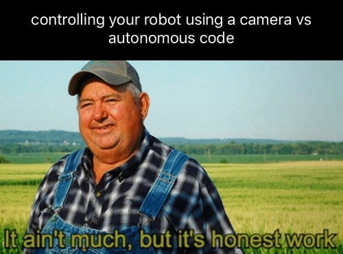

# PyBullet Workspace

## Introduction
This repository contains three hands-on tasks designed to familiarize participants with PyBullet for robotics simulation. The tasks include implementing different control strategies, object manipulation, and lane-following using a Husky robot in various environments. The workshop also includes a presentation titled **"Introduction to PyBullet"** to help participants understand the basics of the PyBullet framework.


## Setup Video Tutorial
Before starting, watch this video tutorial on setting up your environment with Anaconda, PyBullet, and OpenCV:
[](https://youtu.be/YrbAudk7ipE)


## Directory Structure

```
PyBullet
├── Codes (used in Presentation)
│   ├── 2_R_robot.py
│   ├── Joint_array.py
│   ├── Velocity_control.py
│   ├── r2d2.py
│   ├── Cube.py
│   ├── Position_control.py
│   └── bouncinBall_dynamics.py
├── Tasks
│   ├── Task_01
│   ├── Task_02
│   └── Task_03 [ BONUS TASK ]
├── husky
│   ├── husky.urdf
│   └── meshes
├── Introduction To PyBullet.pdf
├── examples
│   ├── camera_feed.py
│   ├── gripper_actions.py
│   ├── move_husky.py
│   └── shooter_actions.py
└── urdf
    ├── arena
    ├── ball
    ├── car
    ├── humanoid
    ├── robot_arm.urdf
    ├── sphere.urdf
    └── wedge.urdf
```

---


### Contents:
1. [Introduction to PyBullet.pdf](./Introduction%20To%20PyBullet.pdf) - Workshop presentation.
2. [Quick Start Guide for PyBullet](./pybullet_quickstartguide.pdf) - Learn PyBullet essentials quickly.
3. [Task 01: Ramp Climbing with Husky](#task-01-ramp-climbing-with-husky)
4. [Task 02: Ball Manipulation and Shooting](#task-02-ball-manipulation-and-shooting)
5. [Task 03 (Bonus): Line Following with Husky](#task-03-bonus-line-following-with-husky)
6. [Workshop Recording](#workshop-recording) - Complete workshop video recording

---

## Task 01: Ramp Climbing with Husky

**File:** `task_01.py`

**Submission Deadline: January 1st, 2025**

**Objective:**
- Simulate a Husky robot to climb a ramp using either torque or velocity control.

**Instructions:**
1. Initialize the PyBullet environment with a plane and a ramp.
2. Load the Husky robot at a specific position.
3. Print the number of joints, joint info, and state.
4. Provide a menu for user input to select either torque or velocity control.
   - **Torque Control:**
     - Experiment to find the optimal torque value that allows the robot to climb the ramp without slipping or toppling.
     - Use the `TORQUE_CONTROL` configuration in `setJointMotorControl`.
   - **Velocity Control:**
     - Experiment to find the optimal velocity value for climbing the ramp without slipping.
     - Use the `VELOCITY_CONTROL` configuration in `setJointMotorControl`.
5. Print the base state and velocity at intervals of 100 simulation steps.
6. Experiment and document the values for optimal torque and velocity in the comments.

[Submit Task 1 Here](https://forms.gle/ha5EuJs3MdLu8SPDA)

---

## Helper Functions

The following helper functions are included in the `examples` folder to assist with Task 2 and Task 3:

- `camera_feed.py`: Capture and process images from the robot's camera.
- `gripper_actions.py`: Control the gripper for object manipulation.
- `move_husky.py`: Move the Husky robot with velocity or position commands.
- `shooter_actions.py`: Automate the ball shooting mechanism.



## Task 02: Ball Manipulation and Shooting

**File:** `task_02.py`

**Submission Deadline: January 1st, 2025**

**Objective:**
- Manipulate a ball using the Husky robot and shoot it towards a humanoid target. Automating the process is encouraged for bonus points.

**Instructions:**
1. Initialize the PyBullet environment with an arena, Husky robot, ball, and humanoid model.
2. Utilize provided helper functions:
   - `open_grip` and `close_grip` for manipulating the ball.
   - `get_image` for capturing the robot's camera feed.
   - `move` for controlling the robot's velocity.
   - `shoot` for launching the ball towards the humanoid.
3. Control the Husky robot to:
   - Grab the ball.
   - Detect the humanoid using camera feed and OpenCV image processing.
   - Shoot the ball towards the humanoid.
4. Automate the grabbing and shooting process using OpenCV image detection for extra points.
5. Test and document the process.

[Submit Task 2 Here](https://forms.gle/dKVT3hFgg23tGFEQ9)

---
### PID Control Reference
Before starting Task 03, it's recommended to understand PID control concepts. Watch this helpful video:
[](https://www.youtube.com/watch?v=4Y7zG48uHRo)

## Task 03 (Bonus): Line Following with Husky

**File:** `task_03.py`

**Submission Deadline: January 1st, 2025**

**Objective:**
- Control the Husky robot to complete one lap of a track without crossing line boundaries using a PID controller.

**Instructions:**
1. Initialize the PyBullet environment with a Husky robot and a track.
2. Use `get_image` to capture the camera feed.
3. Process the camera feed using OpenCV:
   - Convert the image to grayscale.
   - Apply edge detection (e.g., Canny) to identify line boundaries.
   - Calculate the deviation of the robot from the track center.
4. Implement a PID controller to minimize deviation errors.
   - Tune the P, I, and D gains for optimal performance.
   - Use the `move` function to adjust the robot's velocity for line following.
5. Ensure the robot completes one lap without crossing line boundaries.
6. Track the completion of the lap based on position or track-specific markers.
7. Test and document the PID gains and methodology.

[Submit Task 3 Here](https://forms.gle/hzUVgdXpdi1AfpyE6)

---

## Workshop Recording
If you missed the workshop or want to revisit the concepts, the complete recording is available here: [Pybullet Workshop Recording](https://drive.google.com/drive/folders/1zuhOE5z8jLtHmPC2mUknTuhQgz-vYqPS?usp=sharing)

---

## Additional Resources

- **[Introduction to PyBullet.pdf](./Introduction%20To%20PyBullet.pdf):** This presentation provides an overview of PyBullet, including its features, setup instructions, and use cases in robotics simulation.
- **[Quick Start Guide for PyBullet](./pybullet_quickstartguide.pdf):** A concise guide to get started with PyBullet quickly and effectively.

## Setup Instructions

1. Clone this repository:
   ```bash
   git clone <repository_url>
   ```
2. Install PyBullet:
   ```bash
   pip install pybullet
   ```
3. Ensure you have OpenCV installed:
   ```bash
   pip install opencv-python
   ```
4. Run the tasks using Python:
   ```bash
   python task_01.py
   python task_02.py
   python task_03.py
   ```

---

